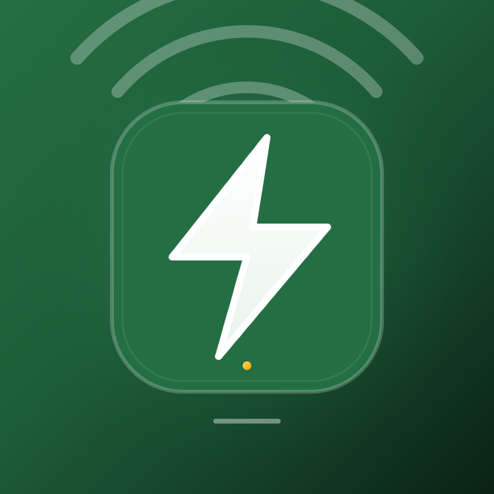
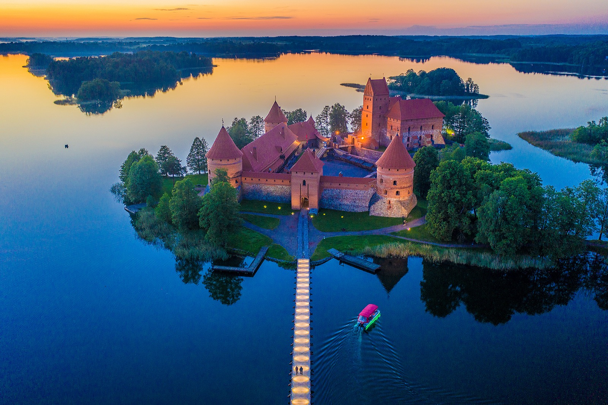
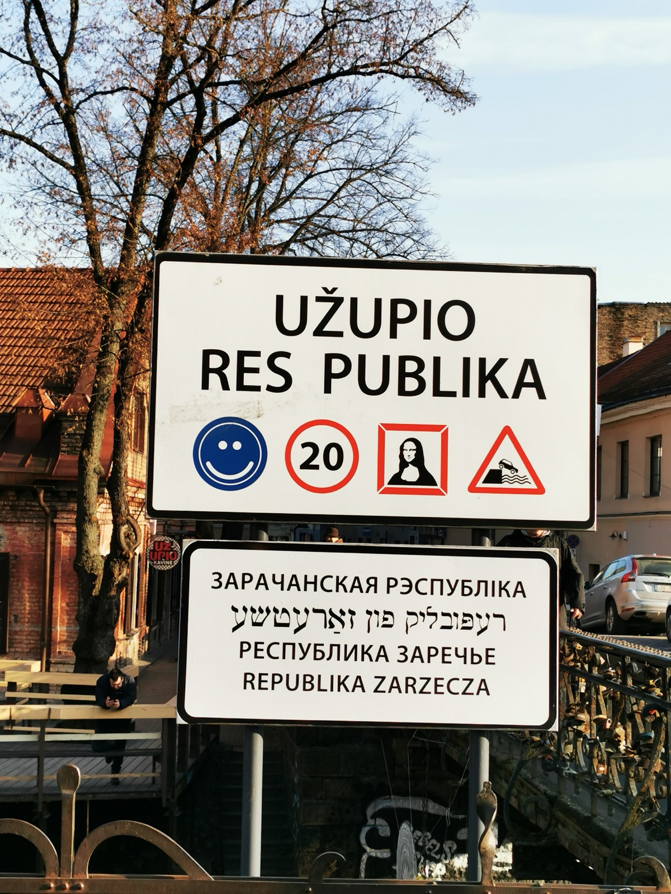
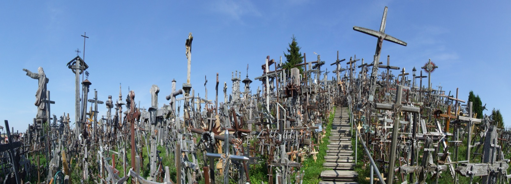

<div align="center">



# TapTale

### **Smart Heritage Audio Guides, Physical Monument Tagging & Cryptographic Digital Passports Across Lithuania**

<br />

<!-- Feature & Status Badges -->
<p align="center">
  <a href="https://github.com/allanindrajith/taptale"></a>
  <a href="#-how-it-works-the-explorer-journey"></a>
  
</p>

<!-- Technology Stack Badges -->
<p align="center">
  
  
  
  
  
  
  
</p>

---

<!-- Quick Anchor Navigation Bar -->
<p align="center">
  <a href="#-core-features"><b>Key Features</b></a> &nbsp;•&nbsp;
  <a href="#-heritage-spotlight-explore-lithuania"><b>Heritage Showcase</b></a> &nbsp;•&nbsp;
  <a href="#%EF%B8%8F-tech-stack--architecture"><b>Architecture</b></a> &nbsp;•&nbsp;
  <a href="#-getting-started"><b>Development</b></a> &nbsp;•&nbsp;
  <a href="#%EF%B8%8F-nfc-tag-writing-specification"><b>NFC & Tag Specs</b></a> &nbsp;•&nbsp;
  <a href="#-the-power-of-nfc-why-tapping-matters"><b>Security</b></a> &nbsp;•&nbsp;
  <a href="#-license"><b>License</b></a>
</p>

---

<p align="center">
  <b>Tap your phone against authentic monument plaques across ancient cities to unlock immersive narrated stories, hidden historical lore, and verifiable passport stamps.</b>
</p>

</div>

<br />

## 🌟 What is TapTale & Why Does it Exist?

Travel apps and guidebooks are disconnected from the physical world. Travelers stare at their screens or read generic Wikipedia summaries rather than engaging with the historic sites right in front of them. Meanwhile, virtual check-in badges can be trivially spoofed from anywhere on a couch.

**TapTale bridges the physical and digital worlds.**

Across cities and cultural landscapes, physical **TapTale NFC plaques** are mounted at historic monuments, castles, bohemian quarters, and shrines. By physically tapping their smartphone against the plaque, explorers:
1. **Prove Physical Presence**: No spoofing, no remote cheats—you must stand before the monument.
2. **Unlock Cinematic Audio Stories**: High-fidelity narrations voiced by storytellers with ambient atmospheric soundscapes.
3. **Discover Secret Lore & Local Quests**: Hidden details, architectural mysteries, and historical trivia unavailable to ordinary tourists.
4. **Collect Digital Heritage Passport Stamps**: An archival travel passport that proves which ancient sites you've touched in person.

---

## ⚡ The Power of NFC: Why Tapping Matters

<table>
  <tr>
    <td width="50%">
      <h3>🔐 True Physical Presence</h3>
      <p>
        Unlike QR codes (which can be screenshotted and shared across social media) or GPS location (which can be easily mocked), <b>NFC requires near-field contact (within 4 cm)</b>. You must physically walk up to the landmark to unlock its tale.
      </p>
    </td>
    <td width="50%">
      <h3>⚡ Instant One-Tap Unlocking</h3>
      <p>
        No camera launching, no bad lighting failures, and no glare from the sun. Just tap the top of your iPhone or the back of your Android against the plaque—native <b>CoreNFC</b> and <b>Android NFC</b> validate the cryptogram in milliseconds.
      </p>
    </td>
  </tr>
  <tr>
    <td width="50%">
      <h3>🛡️ Cryptographic Anti-Counterfeit</h3>
      <p>
        Each monument tag carries a unique cryptographic passkey signature (<code>key=&lt;secretKey&gt;</code>) verified on-device and against TapTale’s heritage registry. Counterfeit or tampered tags are instantly rejected.
      </p>
    </td>
    <td width="50%">
      <h3>🌐 Universal Deep Links</h3>
      <p>
        Standard <b>NDEF URI payloads</b> (<code>https://taptale.app/unlock?spot=&lt;id&gt;&key=&lt;key&gt;</code>) automatically invoke the native app via Universal Links or direct visitors to the progressive web fallback with App Store & Google Play links.
      </p>
    </td>
  </tr>
</table>

---

## 🏰 Heritage Spotlight: Explore Lithuania

TapTale’s premiere registry features the legendary landmarks and secret corners of Lithuania:

<table>
  <tr>
    <td width="33%" align="center">
      
      <br />
      <b>🗼 Gediminas Tower</b>
      <p><i>Vilnius • High Castle</i><br />The cradle of Lithuania's capital. Legend of the howling Iron Wolf dreamt by Grand Duke Gediminas.</p>
    </td>
    <td width="33%" align="center">
      
      <br />
      <b>🏰 Trakai Island Castle</b>
      <p><i>Lake Galvė • Medieval Fortress</i><br />14th-century red-brick fortress floating on shimmering waters, stronghold of Grand Duke Vytautas.</p>
    </td>
    <td width="33%" align="center">
      
      <br />
      <b>🎨 Republic of Užupis</b>
      <p><i>Vilnius • Bohemian District</i><br />The micronation of artists, poets, and dreamers with its own constitution, army of 11, and bronze angel.</p>
    </td>
  </tr>
  <tr>
    <td width="33%" align="center">
      
      <br />
      <b>⛪ Gate of Dawn</b>
      <p><i>Vilnius • Sacred Shrine</i><br />The only surviving gate of Vilnius's defensive city walls, housing the miraculous Renaissance icon of the Virgin Mary.</p>
    </td>
    <td width="33%" align="center">
      
      <br />
      <b>🏛️ Cathedral Square & Bell Tower</b>
      <p><i>Vilnius • Old Town Heart</i><br />The pagan altar transformed into neoclassical grandeur. Step on the secret <i>Stebuklas</i> miracle tile.</p>
    </td>
    <td width="33%" align="center">
      
      <br />
      <b>✝️ Hill of Crosses</b>
      <p><i>Šiauliai • Sacred Sanctuary</i><br />Over 100,000 crosses standing in defiance of oppression, whispering prayers in the Baltic wind.</p>
    </td>
  </tr>
</table>

---

## ✨ Core Features

- 🏷️ **NFC Tap & Unlock**: Instantaneous contactless unlock using hardware NFC (`react-native-nfc-manager`) supporting NTAG213, NTAG215, and NTAG216 plaques.
- 🎧 **Cinematic Audio Guide Player**: Built-in multi-track narration engine with play, pause, progress scrubbing, and ambient background melodies.
- 🌍 **Bilingual Support (English & Lithuanian)**: Fully localized interface and cultural story narration (`en` / `lt`) switchable in real time.
- 🧭 **Live Geofencing & Proximity Radar**: Haversine GPS distance calculation pinpointing meters remaining to nearby heritage spots.
- 🛂 **Explorer Passport & Digital Stamps**: Personal collection system with 30-day access validity per unlock, milestone badges, and travel statistics.
- 📱 **Real-Time Phone Verification**: Frictionless, SMS-based verification login ensuring secure and personalized explorer identity.
- 🎨 **Wise-Inspired High-Craft UI**: Styled with bold typography, high-contrast dark/light themes, and vivid neon accents (`#9fe870`).
- ✍️ **NFC Plaque Provisioner**: Built-in curator tool for cultural staff to format and write cryptographic NDEF payloads directly onto new physical tags on-site.

---

## 📲 How It Works: The Explorer Journey

```
  ┌─────────────────┐       ┌────────────────────┐       ┌──────────────────────┐
  │ 1. EXPLORE      │  ──>  │ 2. LOCATE PLAQUE   │  ──>  │ 3. NFC TAP           │
  │ Check GPS radar │       │ Find physical tag  │       │ Touch phone to badge │
  │ for landmarks   │       │ at the monument    │       │ (Apple/Android NFC)  │
  └─────────────────┘       └────────────────────┘       └──────────┬───────────┘
                                                                    │
                                                                    ▼
  ┌─────────────────┐       ┌────────────────────┐       ┌──────────────────────┐
  │ 6. EARN STAMPS  │  <──  │ 5. AUDIO STORY     │  <──  │ 4. VERIFY & UNLOCK   │
  │ Stamp passport  │       │ Immersive guided   │       │ Cryptographic check  │
  │ & level up rank │       │ audio narration    │       │ 30-day access token  │
  └─────────────────┘       └────────────────────┘       └──────────────────────┘
```

---

## 🛠️ Tech Stack & Architecture

- **Framework**: [Expo SDK 52](https://expo.dev) + [React Native 0.76](https://reactnative.dev)
- **Routing**: [Expo Router v4](https://docs.expo.dev/router/introduction/) (File-based navigation & Deep Linking)
- **NFC Engine**: `react-native-nfc-manager` (Native iOS CoreNFC & Android NDEF)
- **Audio Experience**: `expo-av` (Spatial narration & background musical atmosphere)
- **Location Services**: `expo-location` (Geo-radar & distance matrices)
- **State & Storage**: Safe multi-layer storage with fail-safe memory caches and persistent tokens
- **Design System**: Tailored Scandinavian design language inspired by Wise (`#9fe870` lime accent, `#0e0f0c` ink, `#163300` deep canvas)

---

## 🚀 Getting Started

### Prerequisites

- [Node.js](https://nodejs.org) (v18 or higher recommended)
- [Expo Go](https://expo.dev/go) or an [EAS Development Build](https://docs.expo.dev/develop/development-builds/introduction/)
- Physical iOS or Android device with NFC enabled (Simulators lack physical NFC hardware)

### 1. Clone the repository

```bash
git clone https://github.com/allanindrajith/taptale.git
cd taptale
```

### 2. Install dependencies

```bash
npm install
```

### 3. Start the local development server

```bash
npx expo start
```

### 4. Running with Native NFC

Because physical NFC hardware APIs require native device capabilities, run on a connected device via development build:

```bash
# iOS device (requires macOS + Xcode)
npx expo run:ios --device

# Android device
npx expo run:android --device
```

Or build an installable APK / IPA with EAS Build:

```bash
eas build --profile preview --platform android
eas build --profile preview --platform ios
```

---

## 🏷️ NFC Tag Writing Specification

For heritage preservation boards and cultural coordinators configuring physical tags:

- **Chip Compatibility**: NTAG213, NTAG215, NTAG216, MIFARE Ultralight
- **Record Type**: NDEF URI (`0x01` / Well-Known)
- **URI Format**:
  ```
  https://taptale.app/unlock?spot=<SPOT_ID>&key=<NFC_SECRET_KEY>
  ```
- **Example**:
  ```
  https://taptale.app/unlock?spot=gediminas-tower&key=GDM-VIL-9471-XN
  ```

---

## 📄 License

This project is open-source under the [MIT License](LICENSE).

---

<div align="center">
  Crafted with passion for heritage preservation and real-world exploration by <a href="https://itsallan.me" target="_blank"><b>Allan Indrajith</b></a> &bull; <a href="https://itsallan.me"><b>itsallan.me</b></a>
</div>
